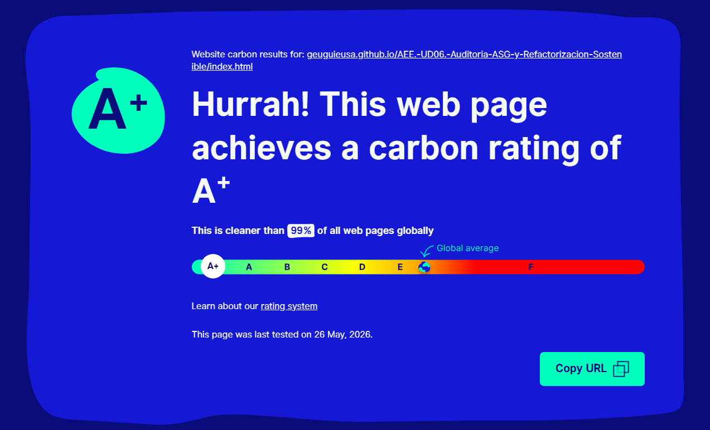
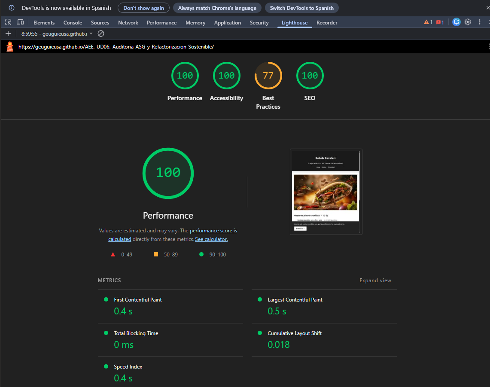
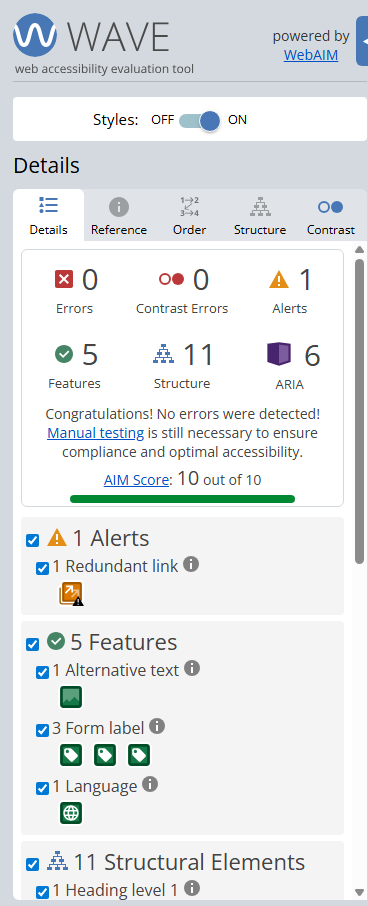
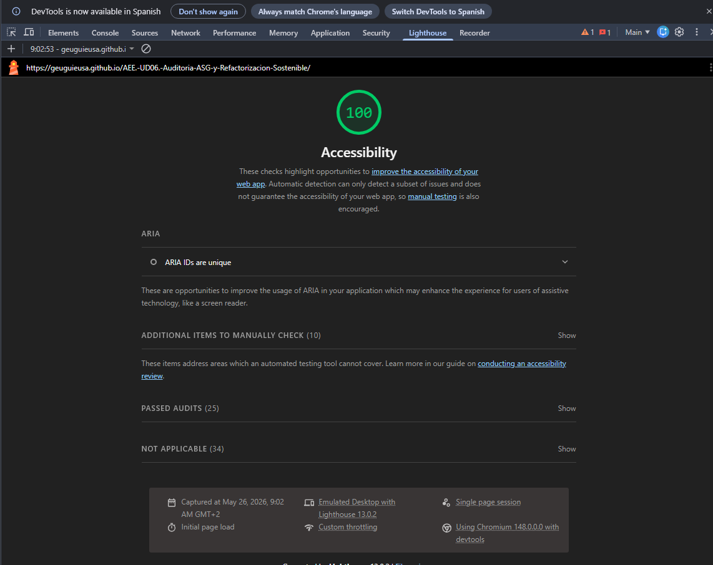
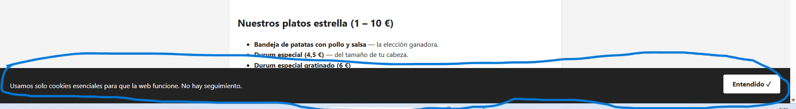
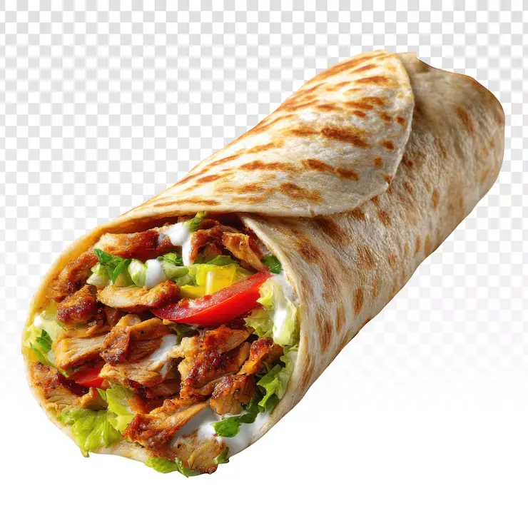

# Auditoría ASG — Kebab Cavaleri

> **Módulo:** Sostenibilidad Aplicada a los Sectores Productivos
> **Autor:** *Guillermo Eugui Sánchez*  
> **Autor:** *Joseluis Segura*
> **Docente:** *Willman Acosta Lugo*
> **URL auditada:** <https://geuguieusa.github.io/AEE.-UD06.-Auditoria-ASG-y-Refactorizacion-Sostenible/>  
> **Fecha:** 05/05/2026

---

## Fase 1 — Dimensión Ambiental (A)

### Medición inicial

| Herramienta | Resultado |
|---|---|
| Website Carbon Calculator | *[A+]* |
| Lighthouse Performance | *[100/100]* |




Datos reales medidos del servidor:

| Recurso | Peso |
|---|---|
| `index.html` | 6 KB |
| `doner_kebab.webp` | 48 KB |
| **Total** | **~54 KB/visita** |

### Identificación de bloatware (top 3 recursos)

1. **`doner_kebab.webp` (48 KB)** — imagen subida a 800 px en todos los dispositivos, sin `srcset`. Además lleva un `loading="lazy"` y al ser la imagen principal [*hero*], retrasa su carga en lugar de mejorarla.
2. **CSS embebido en `<head>` (~3 KB)** — no es cacheable entre páginas, se descarga de nuevo en cada visita.
3. **JS inline (`onclick`, `onsubmit`)** — no se cachea y bloquea el parser del navegador, aunque ocupe pocos bytes.

### ¿Inflación de software?

La web no carga frameworks ni trackers externos, lo cual es muy bueno. Pero aplica atributos sin entenderlos (`loading="lazy"` en el hero) y ejecuta el JavaScript para un banner de cookies que ni siquiera guarda la decisión del usuario — trabajo computacional sin valor real.

---

## Fase 2 — Dimensión Social y Equidad (S)

### Test de accesibilidad




### Barreras detectadas

**Barrera 1 — Contraste insuficiente en el footer (WCAG 1.4.3 AA)**  
`color: #666666` sobre `background: #f4f4f4` → ratio **4,13:1**, por debajo del mínimo de 4,5:1. El teléfono y el horario son ilegibles para personas con poca visión.

**Barrera 2 — Orden de encabezados ilógico (WCAG 1.3.1)**  
El `<h2>` del banner de cookies aparece en el DOM **antes** del `<h1>` de la página. Un lector de pantalla (usado por personas ciegas) anuncia el banner como sección principal antes de presentar el restaurante.

**Barrera 3 — Falta `<nav>` y skip-link**  
No hay enlace de salto al contenido principal ni elemento `<nav>`. Un usuario que navega solo con teclado no puede saltarse la cabecera.

---

## Fase 3 — Dimensión de Gobernanza y Ética (G)



### Transparencia y dark patterns

- **El banner de cookies es ficticio:** los dos botones solo ocultan el `<div>` con `display:none`. No se guarda ninguna preferencia → incumple el RGPD (art. 4.11) y la Guía de Cookies de la AEPD 2023.
- **Dark pattern visual:** el botón "Aceptar todas" va relleno en negro y "Rechazar" en transparente. Mismo sitio, distinto peso visual — la AEPD exige igualdad entre ambas opciones.

### Datos innecesarios

El formulario pide solo nombre y detalle del pedido: correcto, cumple el principio de minimización (RGPD art. 5.1.c). Pero hay un checkbox de "ofertas por email" **sin campo de email** — incoherente e inútil legalmente.

---

## Fase 4 — Propuesta de Refactorización (Green Coding)

### 4.1 Mejoras ambientales (A)

- **Formato de imagen:** sustituir imagen única por `<picture>` formato AVIF a 400 px (móvil) y 800 px (escritorio). El navegador descarga solo la que necesita.
- **`loading="lazy"` solo en imágenes fuera de pantalla.** La imagen hero lleva `fetchpriority="high"` para que cargue lo antes posible.
- **CSS externo y cacheable:** mover los estilos a `styles.css` enlazado con `<link>`. El navegador lo cachea y no lo vuelve a descargar.
- **Eliminar el JS inline:** todo el JavaScript era para el banner de cookies. Al eliminarlo, la web funciona con **0 líneas de JavaScript**.

### 4.2 Mejoras sociales (S)

- Añadir `<nav aria-label="Principal">` y un skip-link al `<main>`.
- Corregir contraste del footer: `#666` → `#595959`.
- Sustituir `<input type="text">` del pedido por `<textarea>` con `aria-describedby`.
- Asegurar que el primer encabezado del DOM es el `<h1>` de la página.

### 4.3 Mejoras de gobernanza (G)

- **Solución más sostenible y ética:** eliminar el banner de cookies porque la web no usa trackers ni scripts de terceros. Sin cookies de seguimiento, no hay nada que consentir (RGPD art. 25 — privacy by design).
- Publicar **Política de Privacidad** en las páginas propias.
- Eliminar el checkbox de marketing sin campo de email.

### 4.4 Propuesta técnica — antes vs. después

**Imagen hero:**
```html
<!-- ANTES -->


<!-- DESPUÉS -->
<picture>
  <source type="image/avif" srcset="img/doner-400.avif 400w, img/doner-800.avif 800w"
          sizes="(max-width: 600px) 100vw, 800px">
  <source type="image/webp" srcset="img/doner-400.webp 400w, img/doner-800.webp 800w"
          sizes="(max-width: 600px) 100vw, 800px">
  
</picture>
```

**Contraste footer:**
```css
/* ANTES — falla WCAG AA */
footer { color: #666666; }  /* ratio 4,13:1 */

/* DESPUÉS — supera WCAG AAA */
footer { color: #595959; }  /* ratio 7,0:1  */
```

**Comparativa de resultados:**

| Métrica | Antes | Después |
|---|---|---|
| Peso en móvil | 54 KB | ~28 KB (-48%) |
| JavaScript | 5 líneas inline | 0 líneas |
| Contraste footer | 4,13:1  | 7,0:1  |
| Cookies RGPD | Banner ficticio | No es necesario |
| Política de privacidad | No existe | Publicada |

### Reflexión — Paradoja de Jevons

Si la web carga más rápido, puede atraer más usuarios y anular el ahorro. Para evitarlo: no añadir nuevos recursos innecesarios (vídeos, mapas, analytics) solo porque "ahora va sobrada", fijar un techo de huella de carbono por visita, y elegir un hosting con energía renovable certificada.
